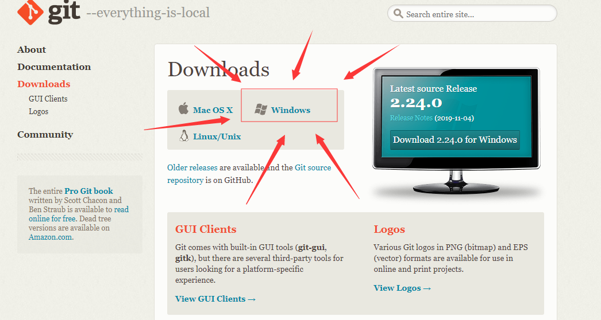
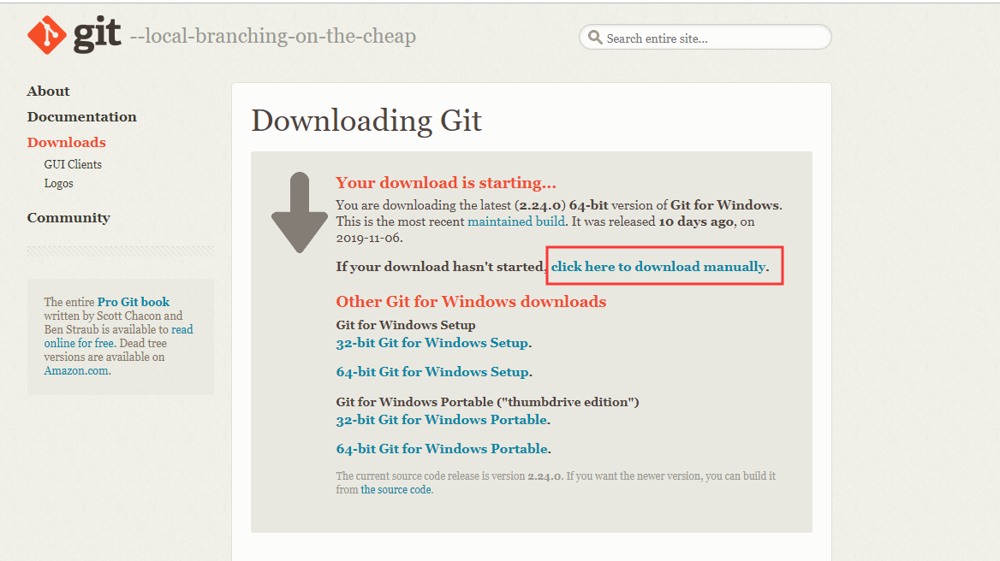
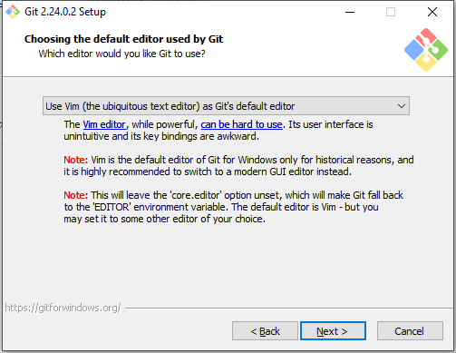

## Git/Github Tutorial for Begainners (Windows Version)

If you are Chinese speaker, please move to [Git/github tutorial in Chinese(Windows version)](./git-win-tutorial-zh_CN.md)

The daily used charset in OS which use Chinese are different from OS in English,the configuration might be different.

### Step 1. Git Installation

Download Git installer from https://git-scm.com/downloads 



Click **Windows** icon and it will jump to download page like this:



Your browser will start downloading automatically in 10 seconds, if not, click the link circled in the picture above instead.

After that, simply double click the .exe file you downloaded, keep everything as default. Some body may have question about text editor defined in this step:



In my opinion, for beginners who have no experience about coding, this tutorial just aimed to teach you about how to commit things to github. You will have nothing to be edit.

For experience developers who just want to learn how to use git & github as a tool to do version control, I believe Vim is not a big issue. The difference between vim and other text editor is, you need to start editing by pressing **i** on your keyboard, and stop editing by pressing **Esc** . To save edited text and quit vim, type **:wq** . Other shortcuts like ```Ctrl+C```, ```Ctrl+V```, ```Ctrl+X``` are exactly the same as other text editors.

### Github Registration

Go to https://github.com/ ,fill in the form.


