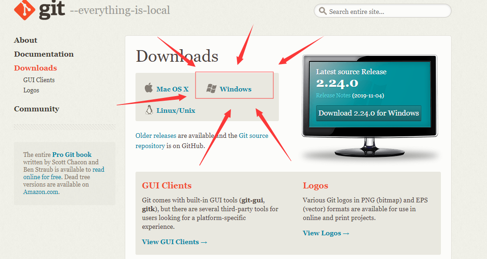
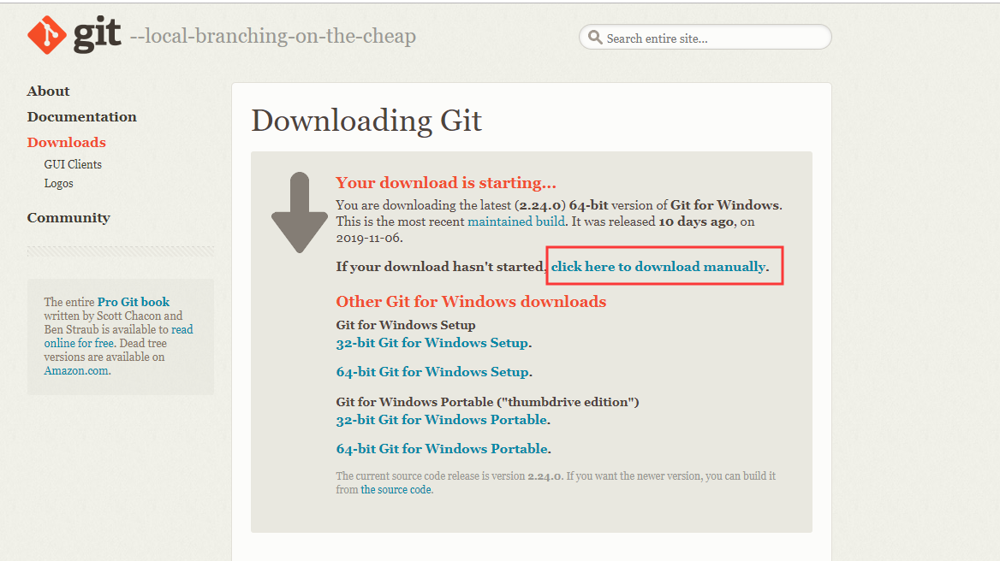
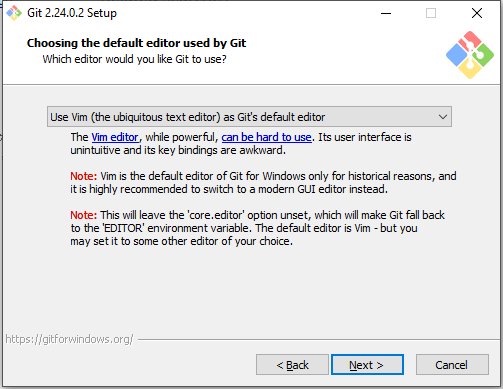
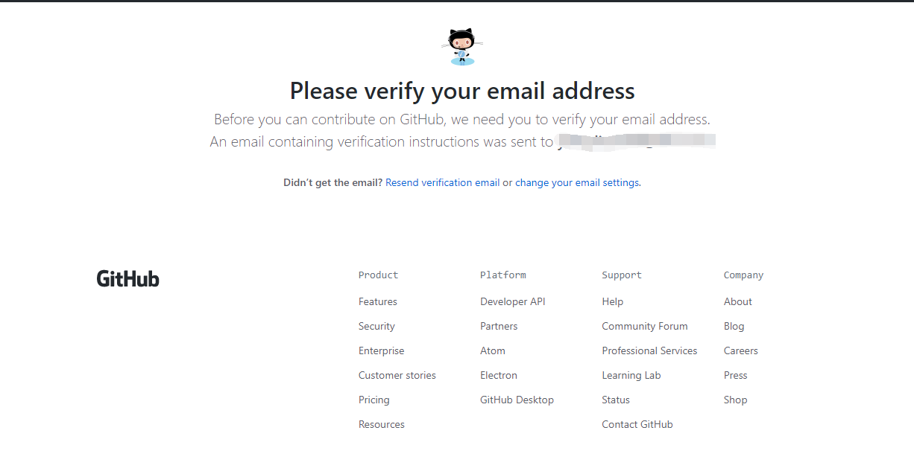
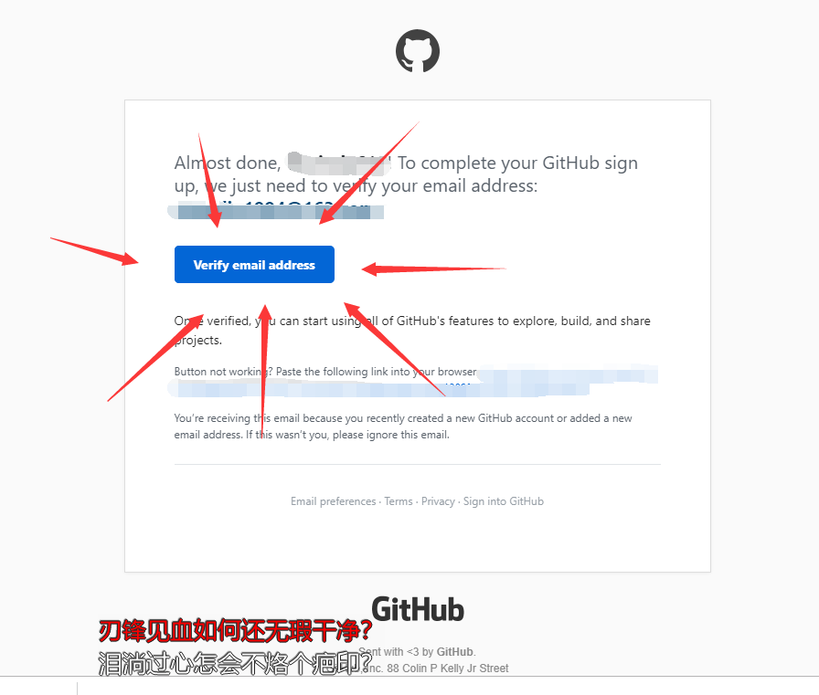
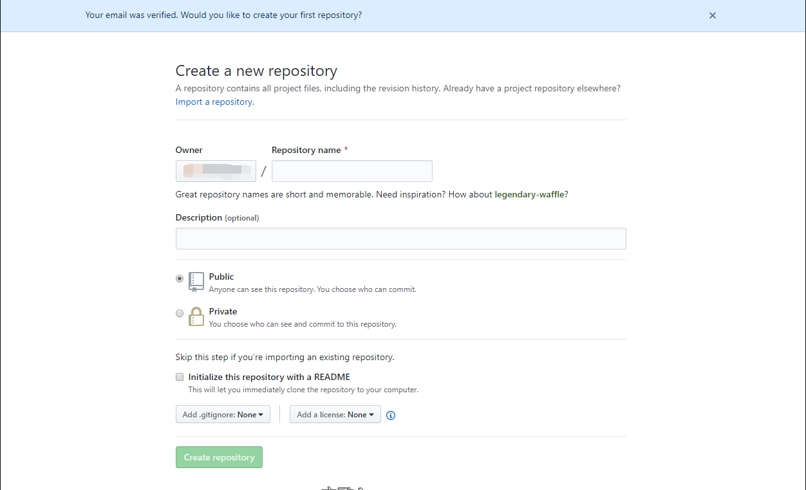
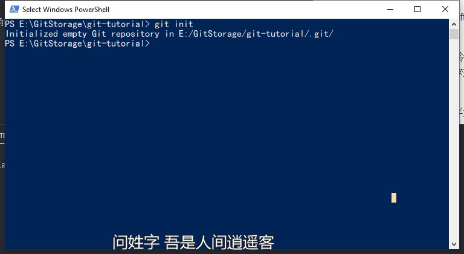
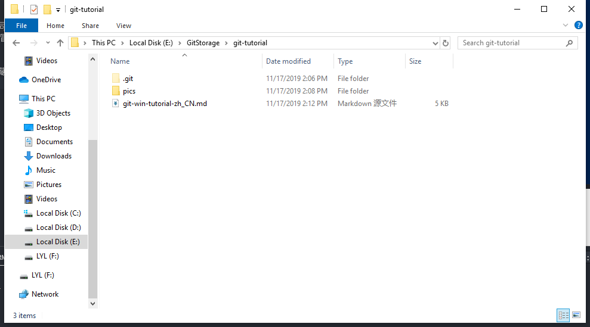
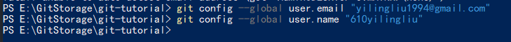

# Git/Github 保姆级使用教程中文版（针对Windows非专业用户）
## Git/Github Tutorial in Chinese for Beginners (Windows Version)

无视图中出现的一些...诡异的歌词，我开着网易云的前台歌词听歌不小心截进去了一些。

### 1. 安装git

在[Git官网下载地址](https://git-scm.com/downloads)中点击Windows,如图：


随后会进入下载页面。如果无一意外会在进入下载页面后10秒之内自动开始下载，如果没有开始自动下载，请点击途中红框所示部分

墙内下载速度较慢，并且没有绝对靠谱的镜像（百度网盘中储存的Git镜像极易被和谐，搜索引擎搜到的不是广告就是老版本）所以推荐在睡觉的时候下载（我在不开VPN的情况下下载了半小时）

下载后双击安装一路点下一步，如果安全软件或者windows本身有提示或者报警，一路放行。

在设置默认文本编辑软件的时候（我的系统语言是英语，对于系统语言是中文的用户应该会显示中文？），如果你没有任何基础也可以直接默认用vim。反正对于初学者其实需要编辑的机会几乎没有，只需要在命令行中push,pull就行了

而对于有基础的人，相信vim不是事。无非开始编辑和结束编辑的画风和普通文本编辑器不太一样，按I开始编辑，esc退出编辑，:wq保存退出而已。我不相信你连Ctrl+C, Ctrl+V, Ctrl+S这种基础的键盘命令都不知道。 但是你如果实在是习惯用其他的编辑器，就在下拉菜单中选择其他的。

其他全部保持默认即可。

需要注意的是，git和github不是完全一样的东西，具体差别可以自行查询。这个教程只是科普如何通过git使用github进行在线仓储功能的。

### 2.注册github账户

进入[Github官网](https://github.com/)填写注册资料，点击“Sign up for Github" 进行注册

注意，如果你看到了以下提示

那么意味着你输入的用户名不符合规范。用户名只能由数字，字母和单个 "-“ 组成（不接受下划线等其他字符），也不能以"-"开头或结尾。

如果在你觉得自己输入的用户名没问题，请检查输入法的字符是否为**半角字符**
对于搜狗输入法，检查方式为随便在键盘上按一个字母调出输入框，然后在输入框任意位置上右键。这个操作会调出搜狗输入法的菜单


查看红框所示**全半角**处是否为月亮标识。如果为太阳标识，点一下即可切换为半角。

成功进入Sign up链接之后会有个类似验证码的东西，我看到的是个把狗子摆正的图。如果看不懂英文可以在词典里查一下。反正无非是摆正图片，让你识别物品之类的东西。我在注册这个新账号时摆了一次哈士奇一次金毛，以后不知道他会怎么作妖。

出现Well Done后点下方按钮进入下一步


选择箭头所指处即可，这是问你要不要氪金的。作为普通用户，免费版已经够用了


下一步是一个小问卷，随便选选然后滑到最下点下一步，除了第一个是否有编程经验外其他都是可以不填的。系统在你开始使用github后会根据你选择的内容给你适当推一点东西，但绝对不是广告轰炸。


这步需要你去注册时填的邮箱


你会收到一封带链接的邮件,点进去按蓝色按钮就行了。如果没有自动跳转，后面文字"Button not working? Paste the following link into your browser" 后有一个链接（我把我自己的打码了），将这个链接复制到浏览器地址栏中进入链接即可。



进入连接之后只要出现 "Your email is verified. Would you like to create your first repository" 就表示你的账户彻底创建成功了。现在可以把这个页面直接叉掉



### 3.将本地目录同步到Github

前往需要同步的目录，按住shift在空白处点击右键，会出现在此处打开PowerShell(win10下。win8下是打开命令窗口)

其实使用git bash here（git命令行操作界面）或者git GUI here（git图形操作界面）应该也可以。但是建议熟悉直接使用命令行，这样对以后跨系统工作有好处（我个人是Windows, Mac, Linux三个系统都在使用，但是Mac用得多）

进入后输入```git init``` 然后按Enter（同样需要半角字符！！！你直接用英文输入法就行了别用中文，用中文在打逗号句号的时候很容易突然冒出来个全角。注意，以下所有命令都需要半角字符！！全角直接报错GG）


此时会在当前目录上创建一个.git 隐藏文件夹


现在开始配置登陆github账户信息以将目录上传至github

在命令行中输入``` git config --global user.name "email@email.com" ```配置全局账户名

双引号中内容为你注册时使用的邮箱（双引号不能省略！是必须的！！！）

按Enter

然后再输入``` git config --global user.name "your_github_username" ```

双引号中内容为你注册时使用的用户名

按Enter



