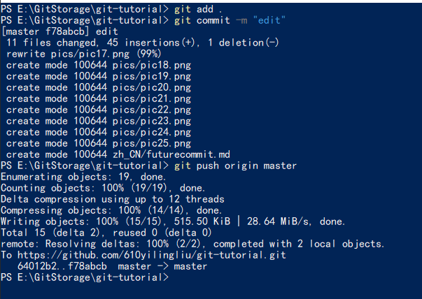

## 再次进入网页中的github仓库
进入[github官网](https://github.com/)
登录后点右上角自己头像，点Your repositories


就会进入你的仓库列表，仓库名进入即可。


## 后续提交与修改

在你修改完仓库内容后，在有.git隐藏文件夹的那个文件夹下按住shift点击右键，选择***在此处打开Power Shell***(Win8及以下为在此处打开命令行窗口)在当前目录下打开命令行窗口


输入```git add .```提交当前目录下所有修改至本地缓存。注意add和英文句号之间有一个空格
再输入```git commit -m "description"``` （双引号内为提交说明）提交至本地仓库


最后输入```git push origin master```上传至github远程仓库即可。

